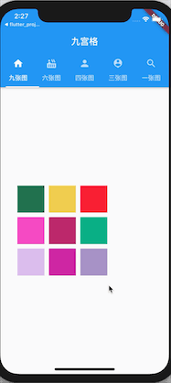

# Flutter仿朋友圈九宫格图片展示

先看效果图

### 整体效果图

### 实际项目中效果


## 前言:

距离 Google 在 2018 世界移动大会上发布 Flutter 的 Beta 版本，Flutter 是 Google 用以帮助开发者在 Android 和 iOS 两个平台，同时开发高质量原生应用的全新移动 UI 框架 

## 简介

最近在学习flutter开发,之前想开发一个聊天APP,作为一个iOS开发者,是闲暇时间学习了Android开发,着手开发完成了聊天,添加好友,删除好友模块,现在公司项目不是很忙,着手学习了flutter,然后就想着继续完善之前的项目,就使用flutter做朋友圈功能吧,然后就有了图片九宫格布局的这个库

## 主要实现

实现方式主要是采用flutter 的 Flow Widget来使用, Flow Widget 加上 Matrix矩阵可以很灵活的调整子布局及大小,可以很方便的实现此功能

不了解Flow的请参考 [Flutter 布局（九）- Flow、Table、Wrap详解](https://www.jianshu.com/p/83c16dd07c7a)

不了解Matrix4矩阵的请参考 [flutter布局-5-Matrix4矩阵变换](https://juejin.im/post/5be2fd9e6fb9a04a0e2cace0)

#### 核心代码

```
//计算每一个子widget的位置  
    for (int i = 0; i < count; i++) {
      var w = context.getChildSize(i).width + x;
      if (w < totalW) {
        context.paintChild(i,
            transform: new Matrix4.translationValues(
                x, y, 0.0));
        x += context.getChildSize(i).width + gap;
      } else {
        x = gap;
        y += context.getChildSize(i).height + gap;
        context.paintChild(i,
            transform: new Matrix4.translationValues(
                x, y, 0.0));
         x += context.getChildSize(i).width + gap;
      }
    }
```

```
/// 设置每个子view的size
  getConstraintsForChild(int i, BoxConstraints constraints) {
    getItemSize();
    return BoxConstraints(
      minWidth: itemW,
      minHeight: itemH,
      maxWidth: itemW,
      maxHeight: itemH
    );

  }

  /// 设置flow的size
  getSize(BoxConstraints constraints){ 
    getColumnsNumber(count);
    getItemSize();
    double h = (columns * itemH) + ((columns - 1) * gap);
    totalW = (itemW * rows) + (gap * (rows + 1));
    return Size(totalW, h);
  }
```
